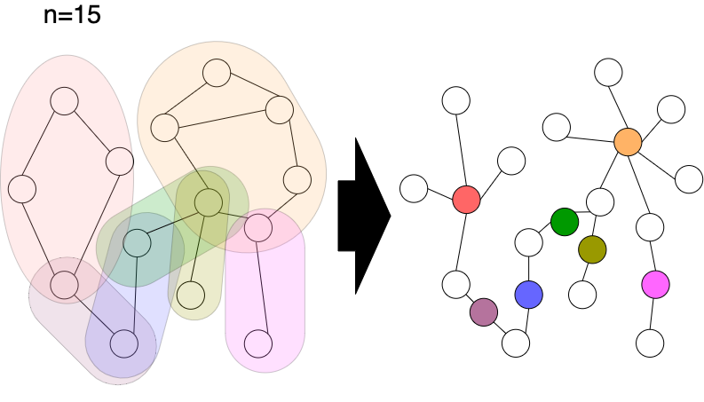

[0, n)：もとの頂点 \
[n, n + n_block)：block\
$\mathrm{deg} > 1 $ $\rightarrow$ 関節点

非再帰 [参考](https://nachiavivias.github.io/cp-library/column/2022/01.html)
## 問題例
[AtCoder Regular Contest 062 F - AtCoDeerくんとグラフ色塗り](https://atcoder.jp/contests/arc062/tasks/arc062_d)
## 参考
[https://twitter.com/noshi91/status/1529858538650374144?s=20&t=eznpFbuD9BDhfTb4PplFUg](https://twitter.com/noshi91/status/1529858538650374144?s=20&t=eznpFbuD9BDhfTb4PplFUg)